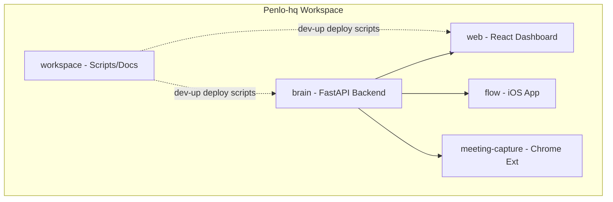
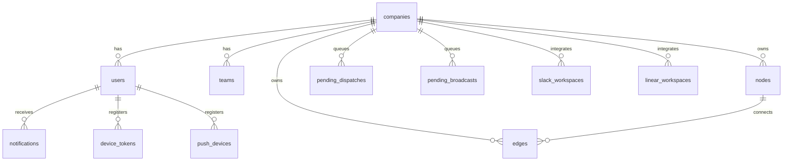
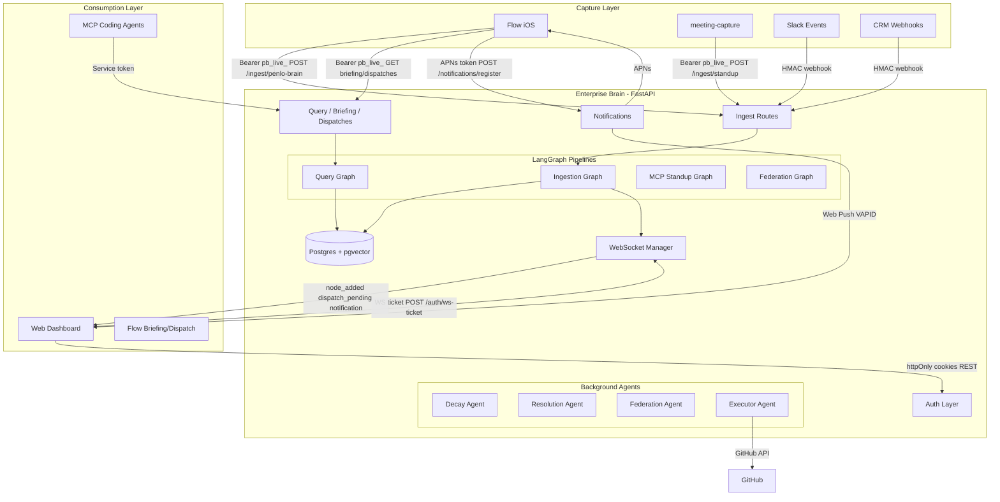
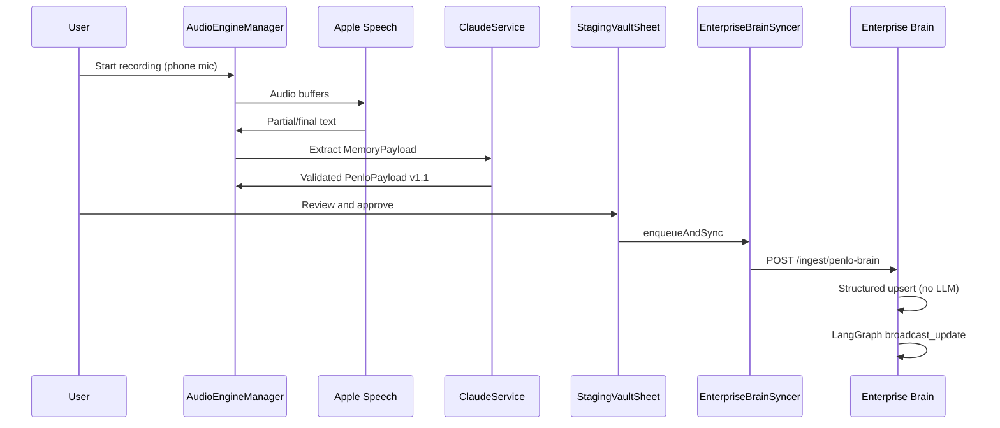
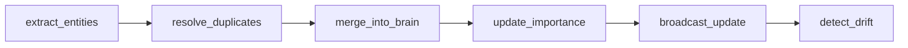
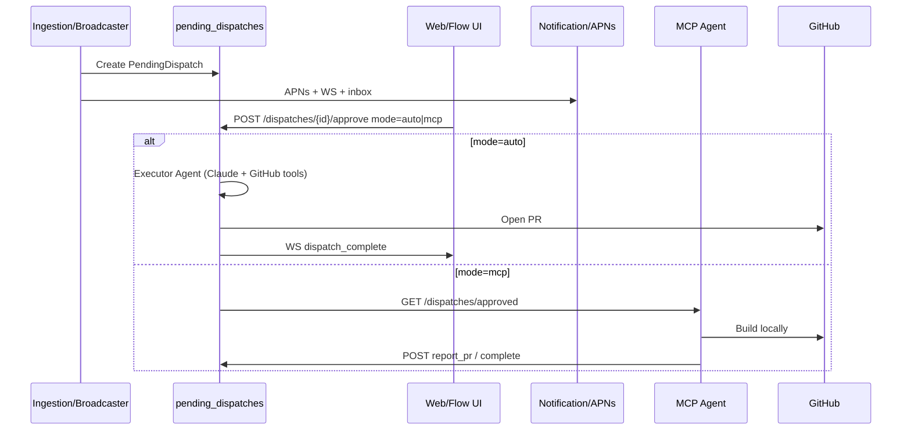
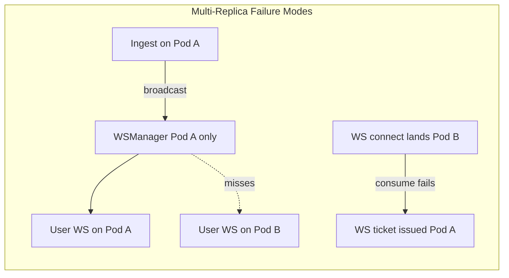

# Penlo Platform — Comprehensive Architectural Summary

**Purpose:** External structural review document for the Penlo Enterprise Brain platform.  
**Scope:** All repos in the standard Penlo clone layout (`brain/`, `web/`, `flow/`, `meeting-capture/`, `workspace/` as siblings).  
**Last updated:** June 2026  
**Companion reviews:** [Appendix A — Private-Node ACL Validation](#appendix-a--private-node-acl-validation-review), [Appendix B — Redis WebSocket Scaling](#appendix-b--redis-websocket-scaling-migration-assessment)

---

## 1. Project Scope and Product Vision

Penlo is a **company memory platform** that eliminates lost context from conversations, meetings, and engineering work. It ingests unstructured input from wearables, mobile apps, Slack, CRM, and standups; builds a **living knowledge graph** (people, decisions, tasks, features, topics); and surfaces it via a web dashboard, natural-language Q&A, pre-meeting briefings, and human-in-the-loop dispatch/broadcast approval workflows.

**Primary users:**
- **Admins / team leads** — graph oversight, dispatch/outbox approval, integrations, team management
- **Employees** — personal brain view, Q&A, activity feed
- **Mobile users (Flow iOS)** — capture, privacy staging, sync, dispatch approval on-the-go
- **Engineering agents (MCP)** — pick approved dispatches, build PRs, report back

**Explicitly out of scope today (Tier 4 backlog per product roadmap):** passive always-on listening, GDPR erasure API, SAML/SSO, multi-region, full mobile settings panel, Flow tasks view, structured request-ID observability.

**Billing:** Stripe Checkout + Customer Portal for Team (per-seat) and Starter (free). See `brain/STRIPE_SETUP.md`.

---

## 2. Monorepo Map and Repository Ownership



| Repository | GitHub | Runtime | Owns |
|------------|--------|---------|------|
| [brain](brain/) | `penlo-hq/brain` | Railway (prod), Docker locally | Graph DB, ingest/query LangGraph pipelines, auth, WS, Slack/Linear, notifications, MCP server |
| [web](web/) | `penlo-hq/web` | Vercel (prod), Vite dev | Dashboard UI, graph viz, admin, Connect App (API keys), dispatch/outbox UI |
| [flow](flow/) | `penlo-hq/flow` | iOS App Store / Xcode | Capture, STT, Claude extraction, staging vault, Brain sync, briefings, dispatch inbox |
| [meeting-capture](meeting-capture/) | `penlo-hq/meeting-capture` | Chrome MV3 | Meet/Zoom caption scrape → standup ingest |
| [workspace](workspace/) | `penlo-hq/workspace` | N/A | Clone layout, `dev-up.sh`, `DEPLOY.md`, integration matrix |

**Integration contract:** [brain/APP_CONTRACT.md](brain/APP_CONTRACT.md) + [brain/contract/schema.json](brain/contract/schema.json) (Penlo Contract v1.1).

---

## 3. Complete Tech Stack

### 3.1 Brain Backend

| Layer | Technology | Version / Notes |
|-------|------------|-----------------|
| Language | Python | 3.11 (CI/Docker) |
| API framework | FastAPI | 0.111 |
| ASGI server | Uvicorn | 0.30 |
| ORM | SQLAlchemy | 2.0 async + asyncpg |
| Migrations | Alembic | 19 revisions |
| Database | PostgreSQL 16 + **pgvector** | Vector dim 1024 (BGE) |
| AI orchestration | **LangGraph** | 0.2.28 |
| LLM | Anthropic Claude | `claude-sonnet-4-6` (default), `claude-opus-4-8` (executor) |
| Embeddings | sentence-transformers | `BAAI/bge-large-en-v1.5` (~1.3GB, skippable via `SKIP_EMBEDDINGS`) |
| Auth | python-jose JWT, passlib/bcrypt | Cookie + Bearer + API keys |
| Rate limiting | slowapi | Per-route limits |
| Observability | Sentry, Langfuse | Errors + query traces |
| Email | Resend | Password reset, notification email |
| Push | pywebpush (VAPID), httpx+h2 (APNs) | Web + iOS |
| Scheduling | APScheduler + asyncio loops | Background agents |
| MCP | `mcp` stdio server | Cursor/agent integration |
| Container | Docker Compose | Postgres + backend + optional Langfuse |

**Key paths:** [brain/backend/api/app.py](brain/backend/api/app.py), [brain/backend/config.py](brain/backend/config.py), [brain/backend/db/models.py](brain/backend/db/models.py), [brain/backend/brain/graphs/](brain/backend/brain/graphs/).

### 3.2 Web Frontend

| Layer | Technology |
|-------|------------|
| Framework | React 18.3 + TypeScript 5.4 (strict) |
| Build | Vite 5.3 |
| Routing | react-router-dom v6 |
| State | **Zustand** (7 stores, no React Query) |
| HTTP | Axios (`withCredentials: true` for httpOnly cookies) |
| Real-time | Native WebSocket singleton |
| Styling | Tailwind CSS 3.4 + Framer Motion |
| Graph viz | d3-force (2D) + Three.js / react-three-fiber (3D) |
| Deploy | Vercel (SPA + security headers) or nginx Docker |

**Key paths:** [web/src/App.tsx](web/src/App.tsx), [web/src/lib/api/endpoints.ts](web/src/lib/api/endpoints.ts), [web/src/lib/ws/client.ts](web/src/lib/ws/client.ts), [web/src/store/](web/src/store/).

### 3.3 Flow iOS

| Layer | Technology |
|-------|------------|
| UI | SwiftUI |
| Persistence | SwiftData (`Transcript`, `SyncQueue`) |
| Wearable | CoreBluetooth (background restore) |
| Audio/STT | AVFoundation + Apple Speech (on-device) |
| Calendar | EventKit |
| AI | Anthropic Messages API (direct from device) |
| Secrets | Keychain (`KeychainStore`) |
| Notifications | UserNotifications + APNs |
| Background | BGAppRefreshTask, UIBackgroundModes |
| Bundle ID | `com.getflow.flow` |

**Key paths:** [flow/flow/flowApp.swift](flow/flow/flowApp.swift), [flow/flow/Services/EnterpriseBrainSyncer.swift](flow/flow/Services/EnterpriseBrainSyncer.swift), [flow/flow/Managers/AudioEngineManager.swift](flow/flow/Managers/AudioEngineManager.swift).

### 3.4 Meeting Capture (Chrome Extension)

- Manifest V3, vanilla JS (no build step)
- Scrapes Google Meet / Zoom captions
- POSTs to `POST /api/v1/ingest/standup` with `Bearer pb_live_` key

### 3.5 MCP Server

- Stdio MCP server in [brain/mcp/server.py](brain/mcp/server.py)
- Tools: `process_standup`, `query_brain`, `get_pending_dispatches`, `report_pr`, etc.
- Auth: hex service token (`PENLO_API_TOKEN`), distinct from user `pb_live_` keys

---

## 4. Database Schema (24 Tables)

**Source:** [brain/backend/db/models.py](brain/backend/db/models.py) + Alembic migrations 001–019.



| Table | Purpose |
|-------|---------|
| `companies`, `teams`, `users` | Multi-tenant identity; roles: `admin`, `team_lead`, `employee` |
| `nodes`, `edges` | Knowledge graph; JSONB `properties`; types per APP_CONTRACT (11 fixed types) |
| `nodes.embedding` | pgvector(1024) — added via migration, not ORM column |
| `ingestion_events` | Per-ingest audit trail |
| `graph_snapshots` | Hourly federated snapshots (JSONB) |
| `api_keys` | Hashed `pb_live_*` keys for mobile/extension |
| `refresh_tokens` | Rotating refresh JTIs with IP/UA metadata |
| `password_reset_tokens`, `invitations` | Hashed one-time tokens |
| `query_citations`, `query_feedback` | Q&A provenance and thumbs up/down |
| `slack_workspaces`, `slack_channel_subscriptions` | Fernet-encrypted bot tokens, channel toggles |
| `linear_workspaces` | Fernet-encrypted Linear token + webhook secret |
| `agent_runs` | LangGraph run records + Langfuse trace IDs |
| `audit_events` | Append-only security/ops log |
| `pending_broadcasts` | Slack draft messages awaiting human approval |
| `pending_dispatches` | Feature/task build cards with `packaged_context` for agents |
| `notifications`, `notification_preferences` | In-app inbox + per-category/channel prefs + quiet hours |
| `push_devices` | Web Push VAPID subscriptions |
| `device_tokens` | iOS APNs tokens (Flow app) |

**Privacy model:** Nodes have `is_private` + `team_id`; ACL enforced in graph routes, WS visibility filters, and notification RBAC.

---

## 5. High-Level Architecture and Component Communication



### 5.1 Authentication Model (Three Token Types)

| Token | Format | Created By | Used By |
|-------|--------|------------|---------|
| Session JWT | httpOnly cookie `penlo_access` + optional Bearer | Web login / Google OAuth | Web dashboard REST + WS ticket |
| API key | `pb_live_` + 48 hex | Web Connect App | Flow iOS, meeting-capture, mobile dispatch |
| MCP service token | Hex bearer | `generate-env.sh` / Railway env | MCP server, coding agents |

**Implementation:** [brain/backend/api/deps.py](brain/backend/api/deps.py) — `get_current_user`, `get_brain_caller`, `get_query_caller`, RBAC via `require_role`.

### 5.2 WebSocket Real-Time Layer

1. Client: `POST /api/v1/auth/ws-ticket` (JWT) → 60s one-time ticket
2. Client: `WS /api/v1/ws/{company_id}?ticket=...`
3. Server: [brain/backend/services/ws_manager.py](brain/backend/services/ws_manager.py) — per-company connection pool, ACL `visible_to` filters on private/team nodes
4. Web client: [web/src/lib/ws/client.ts](web/src/lib/ws/client.ts) — buffers until graph hydrated, exponential backoff reconnect

**Event types:** `node_added`, `node_updated`, `edge_added`, `ingestion_event`, `dispatch_pending`, `dispatch_building`, `dispatch_complete`, `dispatch_failed`, `broadcast_pending`, `broadcast_acted`, `notification`.

**Scaling limitation:** In-memory WS manager and ticket store — **not horizontally scalable** without Redis/sticky sessions.

---

## 6. Core Features and Primary Data Flows

### 6.1 Flow iOS: Capture → Extract → Approve → Sync



**Key behavior:**
- Sync is **user-gated** — no auto-upload after extraction
- Failed syncs → `SyncQueue` SwiftData table with retry on foreground
- Incremental sync filters facts/vaultFiles since `lastSyncDate`
- Contract v1.1: SPO triples in `facts[]`, 11 node types, honest confidence scores

**Gap:** BLE wearable audio is **not wired** to transcription — connection state only.

### 6.2 Brain: Full LLM Ingestion Pipeline

For Slack, CRM, standups, and unstructured `/ingest/penlo`:



**Nodes:** [brain/backend/brain/nodes/](brain/backend/brain/nodes/) — `entity_extractor`, `deduplicator`, `merger`, `importance_scorer`, **`broadcaster`**, `drift_detector`.

**Broadcaster side-effects** ([broadcaster.py](brain/backend/brain/nodes/broadcaster.py)):
- WS fan-out (`node_added`, dispatch/broadcast counts)
- Creates `pending_dispatches` for high-confidence feature/task nodes
- Queues `pending_broadcasts` for subscribed Slack channels
- Emits notifications (ingestion significant, dispatch/broadcast pending)
- Fire-and-forget APNs to admin/team_lead `device_tokens`

### 6.3 Natural Language Query

**Graph:** [brain/backend/brain/graphs/query.py](brain/backend/brain/graphs/query.py)

```
classify_intent → (people | decision | task subagent | primary_retrieval)
  → expand_context → check_freshness → detect_contradictions
  → synthesize_answer → build_citations
```

- Semantic retrieval via pgvector embeddings
- Subagents in `query_subagents.py` for specialized intents
- Citations stored in `query_citations`; feedback in `query_feedback`
- Langfuse tracing on query runs

### 6.4 Dispatch Approval Loop (Human-in-the-Loop + MCP)



**Executor gated by:** `EXECUTOR_ENABLED`, `GITHUB_TOKEN`, `GITHUB_ALLOWED_REPOS` allowlist.

### 6.5 Slack Broadcast Approval (Outbox)

Similar to dispatch but for Slack message drafts in `pending_broadcasts`. Admin/team_lead approves via web Outbox → posts to subscribed Slack channels.

### 6.6 Pre-Meeting Briefings (Flow)

1. `CalendarManager` reads upcoming events
2. `BriefingScheduler` polls every 5 min
3. `BriefingService` → `GET /api/v1/briefing` (Brain-first, Claude fallback)
4. Injected as chat message + 15-min local notification

### 6.7 Notification System (Full Stack)

| Channel | Backend | Web | Flow iOS |
|---------|---------|-----|----------|
| In-app inbox | `notifications` table + WS `notification` event | TopBar bell, NotificationCenter | N/A |
| Email | Resend via `notification_service` | N/A | N/A |
| Web Push | VAPID via `push_devices` | `sw.js` + NotificationSettings | N/A |
| APNs | `device_tokens` + `apns_client` | N/A | AppDelegate + PushRegistrationService |

**Fan-out:** [brain/backend/services/notification_service.py](brain/backend/services/notification_service.py) — dedupe window, actor self-skip, RBAC (admin/lead for dispatch), quiet hours, channel preferences.

---

## 7. API Surface Summary

All routes mounted under `/api/v1` unless noted. Full route files in [brain/backend/api/routes/](brain/backend/api/routes/).

| Domain | Key Endpoints | Auth |
|--------|---------------|------|
| Auth | login, refresh, logout, me, google, company signup, invites, API keys, ws-ticket | Public / JWT |
| Graph | `/graph/company`, `/me`, `/team/{id}`, `/snapshot` | JWT |
| Nodes | search, CRUD, citations, alert resolve | JWT / BrainCaller |
| Query | `POST /query`, feedback | JWT / query caller |
| Ingest | `/penlo`, `/standup`, `/penlo-brain`, webhooks | HMAC / Bearer |
| Briefing | `GET /briefing` | `pb_live_` |
| Dispatches | list, approve, discard, complete | JWT / `pb_live_` |
| Broadcasts | list, approve, discard | JWT |
| Notifications | register, devices, inbox, preferences, VAPID | JWT / BrainCaller |
| Slack/Linear | OAuth, webhooks, settings | JWT + OAuth |
| WebSocket | `WS /api/v1/ws/{company_id}` | WS ticket |
| Health | `GET /health` | Public |

---

## 8. Third-Party Services (Active)

| Service | Purpose | Config Keys |
|---------|---------|-------------|
| Anthropic | Extraction, Q&A, briefings, executor | `ANTHROPIC_API_KEY`, `CLAUDE_MODEL` |
| PostgreSQL + pgvector | Primary data store | `DATABASE_URL` |
| Resend | Transactional email | `RESEND_API_KEY` |
| Google OAuth | Web sign-in | `GOOGLE_CLIENT_ID` |
| Slack | OAuth, events, slash command, broadcasts | `SLACK_CLIENT_*`, Fernet encryption key |
| Linear | GraphQL connect, webhooks | Per-workspace encrypted tokens |
| GitHub | Auto-build PRs (executor) | `GITHUB_TOKEN`, allowlist |
| Sentry | Error tracking | `SENTRY_DSN` |
| Langfuse | Query tracing | `LANGFUSE_*` |
| Apple APNs | iOS push | `APNS_*` + `.p8` key file |
| VAPID | Web push | `VAPID_*` |
| Railway | Brain hosting (prod) | `railway.toml` |
| Vercel | Web hosting (prod) | `vercel.json` |

---

## 9. State Management Patterns

### Web (Zustand)
- **No React Query** — each view fetches in `useEffect`, manual loading/error
- **graphStore** — Map-based nodes/edges, hydration gate for WS buffer
- **notificationStore** — bootstrap parallel fetch, optimistic mark-read
- **dispatchStore / outboxStore** — pending counts updated via debounced WS (2s)

### Flow iOS
- **SwiftData** via `@ModelActor PersistenceActor` for thread-safe writes
- **@Observable ChatViewModel** — in-memory chat (archived conversations lost on restart)
- **@Published DispatchService / BluetoothManager** — shared from ContentView
- **Keychain** — Claude key, Brain URL/key, email (device-only, unlocked)

### Brain
- **Stateless HTTP** + **in-memory WS/ticket/vendor caches**
- **LangGraph TypedDicts** — `IngestionState`, `QueryState`, `FederationState`, `StandupState`
- **Background asyncio tasks** — decay, resolution, federation, executor, APNs fire-and-forget

---

## 10. CI/CD and Test Coverage

| Repo | CI | Tests |
|------|-----|-------|
| brain | Ruff + Mypy + pytest (Postgres 16 + pgvector) | ~12 test files; SQLite shim in conftest for some unit tests |
| web | typecheck + build | No unit tests |
| flow | None observed | Placeholder test only |
| meeting-capture | None | None |

**Brain test gaps:** No e2e WS, Slack OAuth, executor/GitHub, full ingestion graph integration. **Mypy:** ~240 pre-existing errors block CI test job.

**Deploy:** [DEPLOY.md](DEPLOY.md) — Railway (brain) + Vercel (web); `scripts/dev-up.sh` for local Docker stack.

---

## 11. Technical Debt

### 11.1 Architecture / Scalability

| Issue | Impact | Location |
|-------|--------|----------|
| In-memory WS manager + ticket store | Cannot scale brain horizontally | `ws_manager.py`, `ws_ticket.py` |
| In-memory vendor/Linear caches | Lost on restart; not shared across replicas | `slack.py`, `linear.py` |
| `create_all` + Alembic dual path | Schema drift risk | `app.py` lifespan + Docker migrate |
| SQLite tests vs Postgres prod | Vector dedup/resolution untested in CI | `tests/conftest.py` |
| 1.3GB embedding model in prod image | Slow deploys, high memory | `requirements.txt`, Dockerfile |

### 11.2 Flow iOS Incomplete Layers

| Issue | Impact |
|-------|--------|
| BLE audio not connected to STT | Wearable path is UI-only |
| No persistent chat history | Conversations lost on restart |
| Orphan UI (`BriefingsView`, `StreamCard`) | Dead code / incomplete features |
| Remote notification handler stub | No silent/background push processing |
| Demo transcript seeding on fresh install | Confusing in production |
| "Mark all reviewed locally" without sync | Data never reaches Brain |

### 11.3 Web Frontend

| Issue | Impact |
|-------|--------|
| Client-only RBAC guards | Must rely entirely on backend 403 |
| No React Query / centralized data layer | Inconsistent loading/error patterns |
| Optimistic notification markRead without rollback | Stale UI on API failure |
| Dispatch over-fetch on state changes | Performance under load |
| Dead Tailwind animation classes in ToastHost | Cosmetic |

### 11.4 Backend Code Quality

| Issue | Impact |
|-------|--------|
| MCP config outside Pydantic Settings | Misconfig surfaces at runtime | `deps._mcp_token_map()` |
| Unused `get_mcp_company()` | Dead code |
| Duplicate Alembic revision `009` | Operational fragility |
| ~240 mypy errors | CI test job blocked |
| Executor high blast radius | GitHub write if misconfigured |

---

## 12. Security Posture

### 12.1 Strengths

- Strong secret validation (JWT ≥32 chars, webhook secrets ≥16, Fernet key format, CORS no wildcard)
- Webhook HMAC + timestamp + replay cache ([webhooks.py](brain/backend/services/webhooks.py))
- Refresh token rotation with `replaced_by` FK chain
- Invitation/password reset token hashing (not stored plaintext)
- API key SHA-256 storage; redaction in activity logs
- `packaged_context` withheld from dispatch card API responses
- Rate limits on auth, ingest, query
- Sentry PII off; timing-safe login via dummy bcrypt
- httpOnly cookies (no JWT in localStorage on web)
- WS uses short-lived ticket exchange (not raw cookie in WS URL)
- Keychain-only storage for `pb_live_` on iOS

### 12.2 Vulnerabilities and Risks

| Risk | Severity | Detail |
|------|----------|--------|
| Client-only RBAC on web | Medium | UI hides routes; backend must always enforce |
| Cross-origin cookie config | Medium | Prod requires `SameSite=None` + HTTPS; misconfig breaks auth |
| WS ticket in query string | Low | May appear in proxy logs; 60s TTL mitigates |
| Permissive Vercel CSP `connect-src https: wss:` | Low–Medium | Reduces XSS exfiltration protection |
| Executor GitHub access | High if misconfigured | Gated by env flags but powerful when enabled |
| In-memory tenant state | Medium | Multi-instance data inconsistency |
| Linear API token in browser form | Medium | Standard pattern; requires HTTPS |
| No GDPR/user deletion API | Compliance gap | PII persists in graph nodes |
| APNs silently disabled without env | Ops gap | No error when push creds missing |
| Push device not unregistered on logout | Low | Stale web push subscriptions |

---

## 13. Performance Bottlenecks

| Bottleneck | Where | Mitigation Today |
|------------|-------|------------------|
| Embedding model load | Brain startup | `SKIP_EMBEDDINGS` for dev |
| Claude extraction per transcript segment | Flow + ingest graph | User-gated sync; async processing |
| Full graph hydration on web load | Web graph views | WS buffer until hydrated |
| 5s dispatch polling (Flow sheet open) | DispatchService | Acceptable for MVP |
| 30s badge polling (Flow background) | ContentView timer | Could use push-only |
| pgvector similarity in resolution agent | Background loop | Per-company sequential |
| httpx new client per APNs push | apns_client | JWT cached 50 min; connection not pooled |
| No CDN for web assets | Vercel handles this in prod | — |
| LangGraph full pipeline on every Slack message | Ingest | Queue/retry on failure only |

---

## 14. Missing Features and Structural Improvements

### 14.1 Product Gaps (from roadmap)

- **Audit log UI** — `audit_events` table exists; no admin viewer
- **Full settings panel (Flow)** — only HardwareManagementSheet; no unified settings for Claude key, Brain URL, account, version
- **Tasks view (Flow)** — tasks in graph/web but not mobile
- **Passive listening** — always-on capture from old Penlo not ported
- **Data export** — no JSON/CSV graph export
- **GDPR erasure** — no `DELETE /auth/me` PII scrub
- **Billing** — no Stripe
- **SAML/SSO** — JWT + Google only
- **Request ID middleware + structured logging** — Sentry only, no correlation IDs

### 14.2 Structural Improvements (Recommended for Robustness)

**P0 — Production hardening**
1. **Redis-backed WS + ticket store** — enable horizontal brain scaling
2. **Remove `create_all` from lifespan** — Alembic-only schema management
3. **Fix CI** — mypy baseline or scoped checks; pytest against real Postgres in CI (already configured but blocked)
4. **Complete APNs ops** — migration 019, env vars, `.p8` mount, E2E device test
5. **Merge flow/web PRs** — org write access or admin merge

**P1 — Cohesion and reliability**
6. **Unify iOS push path** — done in latest brain; verify deployed
7. **Wire BLE audio → AudioEngineManager** — complete wearable pipeline
8. **Centralized web data layer** — React Query or TanStack Query for cache/invalidation
9. **Server-side RBAC mirrors on web** — defense in depth for WS pending counts
10. **Persistent Flow chat history** — SwiftData or Brain-backed conversations
11. **MCP config in Settings class** — fail fast at startup

**P2 — Enterprise readiness**
12. **Audit log API + admin UI**
13. **GDPR deletion workflow** — scrub user PII from nodes, cascade deletes
14. **Graph export API**
15. **SAML/OIDC** for enterprise SSO
16. **Multi-region** — read replicas, EU data residency
17. **Notification typed email templates** — beyond generic `send_notification_email`
18. **Web push unregister on logout**
19. **Connection pooling for APNs httpx client**

---

## 15. Deployment Topology (Production)

```
┌─────────────────────────────────────────────────────────┐
│ Vercel (web)                                             │
│  penlo-web → VITE_API_URL / VITE_WS_URL → Railway brain │
│  COOKIE_SAMESITE=none for cross-origin session cookies    │
└───────────────────────────┬─────────────────────────────┘
                            │ HTTPS + WSS
┌───────────────────────────▼─────────────────────────────┐
│ Railway (brain)                                            │
│  penlo-enteprisebrain-production.up.railway.app           │
│  Postgres + pgvector addon                                 │
│  Alembic migrate on deploy                                 │
│  APNS_* + VAPID_* + ANTHROPIC_* + SLACK_* env vars        │
└───────────────────────────┬─────────────────────────────┘
                            │
        ┌───────────────────┼───────────────────┐
        ▼                   ▼                   ▼
   Flow iOS           meeting-capture      MCP (local/Cursor)
   TestFlight/App     Chrome Web Store     Developer machine
   Store              Extension
```

---

## 16. Key Documentation Index for Reviewers

| Document | Path |
|----------|------|
| Brain README + architecture diagram | [brain/README.md](brain/README.md) |
| iOS ↔ Brain contract (authoritative) | [brain/APP_CONTRACT.md](brain/APP_CONTRACT.md) |
| Penlo Contract v1.1 JSON Schema | [brain/contract/schema.json](brain/contract/schema.json) |
| Local dev setup | [SETUP.md](SETUP.md) |
| Production deploy | [DEPLOY.md](DEPLOY.md) |
| Integration matrix | [README.md](README.md) |
| MCP dispatch workflow | [brain/mcp/README.md](brain/mcp/README.md) |
| Enterprise features spec | [brain/ENTERPRISE_FEATURES.md](brain/ENTERPRISE_FEATURES.md) |
| Env var reference | [brain/.env.example](brain/.env.example) |

---

## 17. Executive Summary for External Reviewers

Penlo is a **multi-client, multi-tenant knowledge graph platform** with a mature FastAPI/LangGraph backend, React dashboard, and iOS capture app. The **core ingest → graph → query → human-in-the-loop dispatch** loop is implemented end-to-end. Authentication is well-designed (httpOnly sessions + hashed API keys + webhook HMAC). Privacy ACLs propagate through graph routes, WebSocket filters, and notifications.

**Primary structural risks for scale:** in-memory WebSocket/ticket state, dual schema migration paths, and CI blocked by pre-existing type errors. **Primary product gaps:** wearable audio pipeline incomplete on iOS, no GDPR/export/SSO, and several Tier 3 features (audit UI, full settings, Flow tasks) documented but not shipped.

**Recommended review focus areas:**
1. Multi-tenant isolation and private-node ACL correctness
2. Horizontal scaling path for brain (Redis WS, sticky sessions)
3. Executor agent security boundary (GitHub write scope)
4. Notification fan-out architecture (DeviceToken vs PushDevice — recently unified)
5. Flow iOS production readiness (BLE, push, persistent state)
6. Test coverage vs production Postgres/pgvector behavior

---

## Appendix A — Private-Node ACL Validation Review

**Review date:** June 2026  
**Scope:** Consistency of `is_private` + `team_id` enforcement across REST graph routes, node CRUD, semantic query, WebSocket fan-out, activity feed, and notification fan-out.

### ACL model (canonical)

| Role | Public nodes | Private nodes (same team) | Private nodes (other team) |
|------|--------------|---------------------------|----------------------------|
| `admin` | Yes | Yes | Yes |
| `team_lead` | Yes | Yes (if `team_id` matches) | No |
| `employee` | Yes | Yes (if `team_id` matches) | No |
| No team assigned | Public only | No | No |

**Implementation:** `visible_node_filter()` in `brain/backend/api/deps.py` — admins filter by `company_id` only; others require `is_private = false OR team_id = caller.team_id`.

### Component-by-component findings

| Surface | File | Status | Notes |
|---------|------|--------|-------|
| Graph REST (`/graph/company`, `/me`, `/team/{id}`) | `api/routes/graph.py` | **Pass** | All queries use `visible_node_filter(caller)` or equivalent team-scoped `or_()` |
| Graph snapshots | `api/routes/graph.py` | **Pass** | Post-filters snapshot JSON via `_is_node_visible_caller`; edges trimmed to visible node IDs |
| Node search / get / citations | `api/routes/nodes.py` | **Pass** | Semantic search uses raw SQL with same `(is_private = FALSE OR admin OR team match)` clause, then ORM re-filter via `visible_node_filter` |
| Node patch / delete | `api/routes/nodes.py` | **Pass** | Explicit 403 if private node and caller not admin and team mismatch |
| Activity feed | `api/routes/activity.py` | **Pass** | Filters `node_ids` in events against `visible_node_filter` before returning |
| Query LangGraph | `brain/graphs/query.py` | **Pass** | Vector retrieval SQL includes identical visibility clause; `is_admin` only true for `admin` role |
| WS `default_visibility` | `services/ws_manager.py` | **Pass** | Mirrors graph ACL for node payloads |
| WS edge broadcasts | `brain/nodes/broadcaster.py` | **Pass with caveat** | `_edge_visibility_factory` checks both endpoint node dicts via `default_visibility` |
| WS dispatch/broadcast counts | `ws_manager.admin_or_lead_visibility` | **Pass** | Role-gated; employees never receive pending-count events |
| WS per-user notifications | `ws_manager.send_to_user` | **Pass** | Delivered only to matching `user_id` |
| Ingestion notifications | `notification_service.emit_ingestion_significant` | **Pass** | Private ingest: recipients limited to admins + same-team users |
| Dispatch/broadcast notifications | `notification_service` | **Pass** | Recipients = `admin_and_lead_ids` only |
| Team-scoped alerts | `emit_alert_created` | **Pass** | Employees filtered by `team_id` in emit loop |
| Pending Slack broadcasts | `broadcaster._queue_broadcasts_if_configured` | **Pass** | Only enqueues for **non-private**, company-wide nodes (`not is_private`, `team_id is None`) |
| Federation snapshots | `brain/agents/federation_agent.py` | **Review** | Hourly snapshots store full company graph JSON; **snapshot GET endpoint re-filters per caller** — stored snapshot may contain private nodes at rest |
| Web frontend RBAC | `web/src/App.tsx` | **Defense gap** | UI hides admin routes; does not re-filter WS graph events client-side (relies on backend) |
| MCP service token | `api/deps.get_brain_caller` | **Review** | MCP callers may have `user_id=None`; routes using MCP must not bypass ACL — query/dispatch routes should be audited per-endpoint |

### Gaps and recommendations

1. **Edge WS fallback:** `default_visibility` returns `True` when `is_private` is absent on edge payloads. Mitigated by `_edge_visibility_factory` on `edge_added` broadcasts; verify all edge emit paths use node-aware filtering.
2. **Federation snapshot storage:** Private nodes may persist inside `graph_snapshots.nodes` JSON at rest. Acceptable if snapshot API always post-filters; consider excluding private nodes at write time for defense in depth.
3. **Automated ACL tests:** Add pytest cases: employee on team A cannot read/search/query private nodes on team B; WS subscriber on team A does not receive team B private `node_added`.
4. **Query role for `team_lead`:** Treated same as employee for private cross-team access (correct); document explicitly so reviewers do not expect lead-wide private visibility.

**Overall ACL verdict:** **Adequate for MVP** with consistent SQL/ORM/WS mirroring. Primary residual risk is **storage of private data in federation snapshots** and **lack of automated cross-team ACL regression tests**.

---

## Appendix B — Redis WebSocket Scaling Migration Assessment

**Review date:** June 2026  
**Current state:** Single-process in-memory structures in `brain/backend/services/ws_manager.py` and `ws_ticket.py`.

### What breaks today with multiple brain replicas



| Component | Current | Multi-instance impact |
|-----------|---------|----------------------|
| `WSManager._connections` | `dict[company_id, list[(WebSocket, WSUser)]]` | Broadcasts only reach clients on **same pod** |
| `WSTicketStore` | `TTLCache` in-process | Ticket issued on pod A **invalid on pod B** unless sticky sessions |
| Slack/Linear vendor caches | In-memory | Stale/inconsistent across pods (lower severity) |

### Migration options (ranked)

**Option 1 — Sticky sessions only (short-term)**  
- Railway/load balancer: cookie or IP affinity to one brain instance  
- **Effort:** Low (ops config)  
- **Pros:** No code change  
- **Cons:** Uneven load; pod restart drops all WS; does not fix ticket issue if LB rebalances  

**Option 2 — Redis pub/sub fan-out (recommended P0)**  
- Keep local `WSManager._connections` per pod  
- On `broadcast()`, also `PUBLISH penlo:ws:{company_id} {json_message}`  
- Each pod `SUBSCRIBE penlo:ws:*` and forwards to **local** connections after running `visible_to` predicate locally (user context is per-connection)  
- **Ticket store:** `SETEX ws:ticket:{token} 60 {json_user}` in Redis; `consume` = GETDEL  
- **Effort:** Medium (~2–3 days): add `redis[asyncio]`, `RedisWSBridge` service, env `REDIS_URL`  
- **Pros:** Horizontal scale; standard pattern  
- **Cons:** Redis becomes required infra; pub/sub is fire-and-forget (no persistence of missed messages while offline)

**Option 3 — Dedicated WebSocket gateway**  
- Separate lightweight service owns all WS connections; brain publishes events via Redis/NATS  
- **Effort:** High  
- **Pros:** Clean separation; brain workers stay stateless  
- **Cons:** New deployable, ops complexity  

### Recommended implementation sketch (Option 2)

```python
# services/ws_redis_bridge.py (new)
class RedisWSBridge:
    async def publish(self, company_id: str, message: dict) -> None:
        await redis.publish(f'penlo:ws:{company_id}', json.dumps(message))

    async def subscribe_loop(self, ws_manager: WSManager) -> None:
        pubsub = redis.pubsub()
        await pubsub.psubscribe('penlo:ws:*')
        async for msg in pubsub.listen():
            company_id = extract_company(msg.channel)
            await ws_manager.broadcast_local(company_id, json.loads(msg.data))
```

**Changes required:**

| File | Change |
|------|--------|
| `services/ws_manager.py` | Split `broadcast` into local delivery; optional Redis publish hook |
| `services/ws_ticket.py` | Redis-backed store when `REDIS_URL` set; fallback to TTLCache for local dev |
| `config.py` | Add `redis_url: str = ''` |
| `api/app.py` | Lifespan: start Redis subscriber task |
| `requirements.txt` | `redis[hiredis]>=5.0` |
| `docker-compose.yml` | Add `redis:7` service |
| Railway | Add Redis plugin; set `REDIS_URL` |

### `send_to_user` with Redis

Per-user notification delivery must either:
- Publish with `{target_user_id}` metadata and filter on each pod's local connections, or  
- Hash user sessions to a single pod (sticky by user_id — harder)

**Recommendation:** Include `target_user_id` in Redis message envelope; each pod's subscriber runs the existing `_user_visibility` filter locally.

### Rollout plan

1. Add Redis to docker-compose + local dev (`generate-env.sh`)  
2. Implement dual-write: in-memory + Redis (feature flag)  
3. Integration test: two uvicorn workers, two WS clients, ingest triggers broadcast on both  
4. Deploy Redis on Railway; enable flag in staging  
5. Remove in-memory-only path once stable  

**Scaling verdict:** **Blocked for horizontal brain scaling** until Option 2 or 3 is implemented. Sticky sessions are a temporary workaround only. Estimated **2–3 engineering days** for Option 2 MVP.

---

## Document history

| Version | Date | Change |
|---------|------|--------|
| 1.0 | June 2026 | Initial external review export + ACL and Redis appendices |
